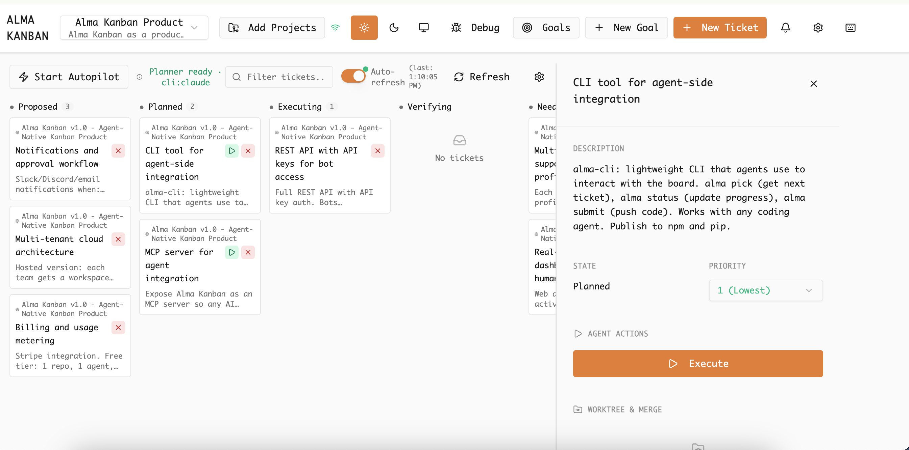
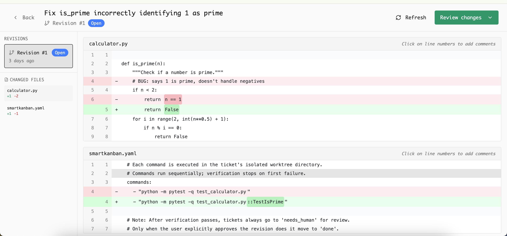

# Alma Kanban

An AI-powered local-first kanban board that uses AI agents to automatically implement tickets. It creates isolated git worktrees for each ticket, runs AI code tools (Claude CLI or Cursor Agent) to implement changes, verifies the results, and manages the workflow through a state machine.

## Demo

<p align="center">
  
</p>

## Screenshots

### Kanban Board
Full board view with ticket states, dependency tracking, and autopilot controls.


### Ticket Detail
Ticket detail panel showing description, state, agent actions, and worktree info.



### Dependency Graph
Visual DAG of ticket dependencies in the debug panel.


### Agent Execution
Live agent activity log streaming during ticket execution.


### Autopilot Running
Board with autopilot active — tickets flowing through executing, verifying, and blocked states.


### Code Review
Revision diff view with inline commenting and approve/request changes workflow.



### Inline Comments
Line-level commenting on revision diffs.


## Tech Stack

| Layer | Technology |
|-------|------------|
| Frontend | React + Vite + TypeScript |
| UI Components | shadcn/ui + Tailwind CSS |
| Backend | FastAPI (Python 3.11+) |
| Database | SQLite + Alembic migrations |
| Background Jobs | In-process SQLiteWorker (ThreadPoolExecutor) |
| AI Executors | Claude Code CLI or Cursor Agent CLI |

## Prerequisites

- **Node.js** 18+ (with npm)
- **Python** 3.11+

No external services (Redis, etc.) required — everything runs in-process.

## Project Structure

```
alma-kanban/
├── frontend/              # React + Vite + TypeScript + shadcn
│   ├── src/
│   │   ├── components/    # UI components (KanbanBoard, TicketDetailPanel, etc.)
│   │   ├── services/      # API client
│   │   └── types/         # TypeScript types
│   └── package.json
├── backend/               # FastAPI application
│   ├── app/
│   │   ├── models/        # SQLAlchemy models (Ticket, Job, Board, etc.)
│   │   ├── routers/       # API route handlers
│   │   ├── services/      # Business logic (planner, executor, worker, etc.)
│   │   ├── middleware/     # Idempotency, rate limiting
│   │   └── main.py        # FastAPI app entry point
│   ├── alembic/           # Database migrations
│   ├── tests/             # pytest test suite
│   └── requirements.txt
├── smartkanban.yaml       # Executor, verification, and planner config
├── Makefile               # Developer scripts
├── run.py                 # Unified launcher (backend + frontend)
└── README.md
```

## Quick Start

### 1. Install Dependencies

```bash
make setup
```

This will:
- Create a Python virtual environment in `backend/venv/`
- Install Python dependencies
- Install Node.js dependencies

### 2. Run Database Migrations

```bash
make db-migrate
```

### 3. Run the Application

**One Command (Recommended):**

```bash
make run
```

Or directly:

```bash
./run.py
```

This starts:
- FastAPI backend (http://localhost:8000) with in-process background worker
- Vite frontend (http://localhost:5173)

Press `Ctrl+C` to stop all services gracefully.

**Manual (2 terminals):**

**Terminal 1 - Backend (http://localhost:8000):**
```bash
make dev-backend
```

**Terminal 2 - Frontend (http://localhost:5173):**
```bash
make dev-frontend
```

### 4. Verify Setup

Test the backend endpoints:
```bash
curl http://localhost:8000/health
# {"status":"ok"}

curl http://localhost:8000/version
# {"app":"Alma Kanban","version":"0.1.0"}
```

Open http://localhost:5173 in your browser to see the frontend.

## Workspace Isolation

Alma Kanban uses git worktrees to provide isolated workspaces for each ticket. This enables safe parallel execution of multiple tickets without interference.

### How It Works

1. When a job (execute/verify) runs for a ticket, a git worktree is created at `.smartkanban/worktrees/{ticket_id}/`
2. Each worktree gets a dedicated branch: `goal/{goal_id}/ticket/{ticket_id}`
3. All execution and verification runs in the isolated worktree directory
4. Logs are written to `{worktree_path}/.smartkanban/logs/{job_id}.log`
5. When a ticket reaches a terminal state (done/abandoned), its worktree is automatically cleaned up

### Configuration

Set these environment variables in `backend/.env`:

```bash
# Path to the git repository (default: project root)
GIT_REPO_PATH=/path/to/your/repo

# Base branch for worktree creation (default: main, fallback: master)
BASE_BRANCH=main
```

### Requirements

- The project must be a git repository
- The configured base branch must exist

If the directory is not a git repository, jobs will run without workspace isolation and log a warning.

## Verification Pipeline

Alma Kanban includes a verification pipeline that runs configurable commands to verify ticket implementations.

### Configuration

Create or edit `smartkanban.yaml` at the repository root:

```yaml
verify_config:
  commands:
    - "pytest tests/"
    - "npm run lint"
```

### How Verification Works

1. When a verify job runs, it loads commands from `smartkanban.yaml`
2. Each command executes in the ticket's isolated worktree directory
3. Commands run sequentially; verification stops on first failure
4. **Evidence** is captured for each command:
   - stdout and stderr are saved to files
   - Exit codes are recorded
   - All evidence is linked to the ticket and job

### State Transitions

Based on verification outcome:

- **All commands succeed:** ticket moves to `needs_human` for review
- **Any command fails:** ticket moves to `blocked` with failure details

### Viewing Evidence

Evidence is displayed in the ticket detail drawer in the UI:
- Expand each command to view stdout/stderr
- Green checkmarks indicate successful commands
- Red X marks indicate failures with exit codes

### API Endpoints for Evidence

| Method | Endpoint | Description |
|--------|----------|-------------|
| GET | `/tickets/{id}/evidence` | List all evidence for a ticket |
| GET | `/evidence/{id}/stdout` | Get stdout content (plain text) |
| GET | `/evidence/{id}/stderr` | Get stderr content (plain text) |

## Background Jobs

Alma Kanban uses an in-process SQLiteWorker (ThreadPoolExecutor + SQLite job queue) to run background jobs. No external services like Redis or Celery are required.

### Job Workflow Example

```bash
# 1. Create a goal
curl -X POST http://localhost:8000/goals \
  -H "Content-Type: application/json" \
  -d '{"title": "Test Goal", "description": "A test goal"}'
# Returns: {"id": "<goal_id>", ...}

# 2. Create a ticket
curl -X POST http://localhost:8000/tickets \
  -H "Content-Type: application/json" \
  -d '{"goal_id": "<goal_id>", "title": "Test Ticket"}'
# Returns: {"id": "<ticket_id>", ...}

# 3. Enqueue an execute job
curl -X POST http://localhost:8000/tickets/<ticket_id>/run
# Returns: {"id": "<job_id>", "status": "queued", ...}

# 4. Check job status (wait a moment for the worker to process)
curl http://localhost:8000/jobs/<job_id>
# Returns: {"id": "<job_id>", "status": "succeeded", "logs": "...", ...}

# 5. Get raw logs
curl http://localhost:8000/jobs/<job_id>/logs
# Returns plain text log output

# 6. List all jobs for a ticket
curl http://localhost:8000/tickets/<ticket_id>/jobs
# Returns: {"jobs": [...], "total": 1}

# 7. Enqueue a verify job
curl -X POST http://localhost:8000/tickets/<ticket_id>/verify
# Returns: {"id": "<job_id>", "status": "queued", ...}

# 8. Cancel a running job (best-effort)
curl -X POST http://localhost:8000/jobs/<job_id>/cancel
# Returns: {"id": "<job_id>", "status": "canceled", "message": "..."}
```

## Development Commands

| Command | Description |
|---------|-------------|
| `make setup` | Install all dependencies (backend venv + frontend npm) |
| `make run` | Start backend + frontend (2 processes) |
| `make dev-backend` | Run FastAPI server with hot reload |
| `make dev-frontend` | Run Vite dev server with HMR |
| `make db-migrate` | Run Alembic database migrations |
| `make lint` | Run linters (ruff + ESLint) |
| `make format` | Format code (ruff + Prettier) |
| `make generate-types` | Generate TypeScript types from OpenAPI spec |
| `make clean` | Remove build artifacts |

Run `make help` for a full list of commands.

## Environment Configuration

### Backend (`backend/.env`)

Copy `backend/.env.example` to `backend/.env`:
```bash
cp backend/.env.example backend/.env
```

Variables:
- `APP_ENV` - Environment (development/production)
- `DATABASE_URL` - SQLite database path
- `FRONTEND_URL` - Frontend URL for CORS
- `GIT_REPO_PATH` - Git repository root path for workspace isolation (optional, defaults to project root)
- `BASE_BRANCH` - Base branch for creating worktree branches (optional, defaults to `main`, falls back to `master`)

### Frontend (`frontend/.env`)

Copy `frontend/.env.example` to `frontend/.env`:
```bash
cp frontend/.env.example frontend/.env
```

Variables:
- `VITE_BACKEND_URL` - Backend API URL

## API Endpoints

| Method | Endpoint | Description |
|--------|----------|-------------|
| GET | `/health` | Health check |
| GET | `/version` | App version info |
| **Goals** | | |
| POST | `/goals` | Create a new goal |
| GET | `/goals` | List all goals |
| GET | `/goals/{id}` | Get goal by ID |
| **Tickets** | | |
| POST | `/tickets` | Create a new ticket |
| GET | `/tickets/{id}` | Get ticket by ID |
| POST | `/tickets/{id}/transition` | Transition ticket state |
| GET | `/tickets/{id}/events` | Get ticket event history |
| POST | `/tickets/{id}/run` | Enqueue execute job |
| POST | `/tickets/{id}/verify` | Enqueue verify job |
| GET | `/tickets/{id}/jobs` | List jobs for ticket |
| GET | `/tickets/{id}/evidence` | Get verification evidence |
| **Jobs** | | |
| GET | `/jobs/{id}` | Get job details with logs |
| GET | `/jobs/{id}/logs` | Get raw job logs |
| POST | `/jobs/{id}/cancel` | Cancel a job |
| **Evidence** | | |
| GET | `/evidence/{id}/stdout` | Get evidence stdout content |
| GET | `/evidence/{id}/stderr` | Get evidence stderr content |
| **Board** | | |
| GET | `/board` | Get kanban board view |

## Code Quality

### Backend (Python)
- **Linter/Formatter:** Ruff (configured in `backend/pyproject.toml`)
- Run: `make lint-backend` / `make format-backend`

### Frontend (TypeScript)
- **Linter:** ESLint
- **Formatter:** Prettier
- Run: `make lint-frontend` / `make format-frontend`

## License

MIT

